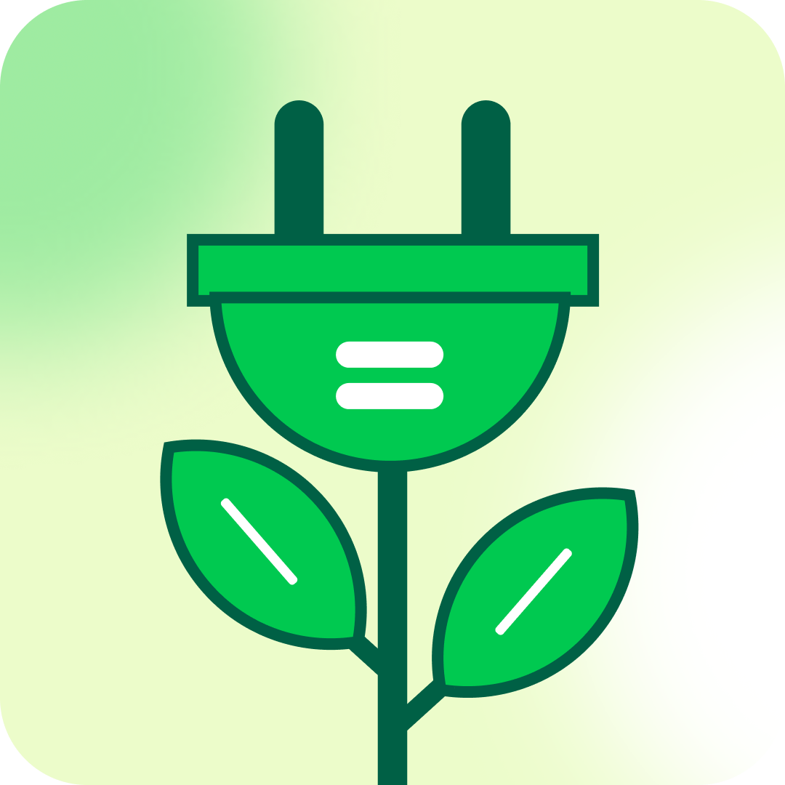

# EwasteHub: Frontend Aplikasi Antar Jemput Sampah Elektronik

<p align="center">
  <picture>
    <source media="(prefers-color-scheme: dark)" srcset="src/assets/img/ewasteDark.png">
    <source media="(prefers-color-scheme: light)" srcset="src/assets/img/ewasteLight.png">
    
  </picture>
</p>


Selamat datang di repositori frontend untuk **EwasteHub**, sebuah aplikasi inovatif yang dirancang untuk merevolusi cara kita mengelola sampah elektronik. Proyek ini bertujuan untuk menyediakan platform yang ramah pengguna, efisien, dan andal untuk menjadwalkan layanan penjemputan sampah elektronik langsung dari rumah.

## 📖 Tentang Proyek

EwasteHub adalah solusi modern untuk masalah limbah elektronik yang terus berkembang. Dengan antarmuka yang bersih dan intuitif, aplikasi ini memungkinkan pengguna untuk dengan mudah mendaftar, masuk, dan mengakses berbagai fitur untuk membuang e-waste mereka secara bertanggung jawab. Dibangun dengan teknologi web modern seperti React dan Vite, aplikasi ini menawarkan performa tinggi dan pengalaman pengguna yang mulus di berbagai perangkat.

## 🛠️ Dibangun Dengan

Proyek ini menggunakan serangkaian teknologi modern untuk memastikan skalabilitas dan kemudahan pengembangan:

- **[React.js](https://reactjs.org/)**: Library JavaScript untuk membangun antarmuka pengguna yang dinamis.
- **[Vite](https://vitejs.dev/)**: Alat build generasi baru yang memberikan pengalaman pengembangan super cepat.
- **[Tailwind CSS](https://tailwindcss.com/)**: Framework CSS utility-first untuk desain yang cepat dan responsif.
- **[React Router](https://reactrouter.com/)**: Untuk routing dan navigasi di sisi klien.
- **[JavaScript (ES6+)](https://www.ecma-international.org/)**: Bahasa pemrograman utama.

## 🚀 Memulai

Ikuti petunjuk ini untuk menyiapkan salinan proyek di mesin lokal Anda untuk tujuan pengembangan dan pengujian.

### Prasyarat

Pastikan Anda telah menginstal [Node.js](https://nodejs.org/) (disarankan versi LTS) dan [npm](https://www.npmjs.com/) di sistem Anda.

### Instalasi

1.  **Clone repositori ini ke mesin lokal Anda:**

    ```sh
    git clone https://github.com/username/frontend-ewastehub-app.git
    ```

2.  **Navigasi ke direktori proyek:**

    ```sh
    cd frontend-ewastehub-app
    ```

3.  **Instal semua dependensi yang diperlukan:**
    Perintah ini akan membaca `package.json` dan mengunduh semua library yang dibutuhkan.
    ```sh
    npm install
    ```

## ⚡ Menjalankan Aplikasi

Setelah instalasi selesai, Anda dapat menjalankan aplikasi dalam beberapa mode:

- **Mode Pengembangan:**
  Jalankan server pengembangan dengan fitur hot-reloading. Aplikasi akan secara otomatis memperbarui tampilan di browser setiap kali Anda menyimpan perubahan pada kode.

  ```sh
  npm run dev
  ```

  Buka [http://localhost:5173](http://localhost:5173) (atau port lain yang ditampilkan di terminal) untuk melihatnya di browser.

- **Build untuk Produksi:**
  Perintah ini akan mengoptimalkan dan menggabungkan semua file untuk performa terbaik di lingkungan produksi.

  ```sh
  npm run build
  ```

  Hasilnya akan tersedia di direktori `dist/`, yang siap untuk di-deploy ke server hosting.

- **Pratinjau Build Produksi:**
  Untuk melihat versi produksi secara lokal, jalankan perintah berikut setelah proses build selesai:
  ```sh
  npm run preview
  ```

## 📂 Struktur Proyek

Struktur direktori proyek ini sudah disesuaikan dengan workspace nyata. Berikut penjelasan dan struktur folder utama:

```
frontend-ewastehub-app/
├── public/                # Aset statis yang langsung diakses browser (favicon, logo, dsb)
├── src/                   # Seluruh source code aplikasi
│   ├── assets/            # Gambar, ikon, dan media lain
│   │   ├── react.svg
│   │   └── img/           # Berisi gambar/logo (misal ewasteDark.png, ewasteLight.png)
│   ├── components/        # Komponen React reusable
│   │   ├── elements/      # Komponen atom/molekul (tombol, input, dsb)
│   │   ├── fragments/     # Komponen organism (gabungan elements)
│   │   └── layouts/       # Layout/template halaman
│   ├── context/           # React Context untuk state global (misal DarkMode)
│   ├── data/              # Data statis/mock (edukasiData.js, kategoriData.js, panduanData.js)
│   ├── hooks/             # Custom React Hooks (useDarkMode, useLoginForm, dsb)
│   ├── pages/             # Komponen halaman utama (HomeView, EdukasiView, dsb)
│   │   ├── auth/          # Halaman autentikasi
│   │   └── dashboard/     # Halaman dashboard (peran admin, kurir, masyarakat)
│   ├── routes/            # Konfigurasi dan definisi rute aplikasi
│   ├── services/          # Service layer untuk API call
│   ├── store/             # State management (integrasi backend)
│   └── utils/             # Utility/helper functions
│   ├── App.jsx            # Komponen aplikasi utama
│   ├── index.css          # CSS global dan Tailwind imports
│   └── main.jsx           # Entry point React
├── dev-dist/              # Build hasil development mode (otomatis oleh Vite)
├── .gitignore             # File/folder yang diabaikan Git
├── eslint.config.js       # Konfigurasi ESLint
├── index.html             # Titik masuk HTML utama
├── package.json           # Daftar dependensi & skrip proyek
├── package-lock.json      # Lock file dependensi
├── vite.config.js         # Konfigurasi Vite
└── README.md              # Dokumentasi proyek
```

**Penjelasan Singkat:**

- `public/`: Berisi aset statis yang tidak diproses oleh Vite (favicon, logo, dsb).
- `src/assets/`: Gambar, ikon, dan media lain yang digunakan di aplikasi.
- `src/components/`: Komponen React yang reusable, dipisah berdasarkan tingkatannya (elements, fragments, layouts).
- `src/context/`: State global menggunakan React Context (misal dark mode).
- `src/data/`: Data statis atau mock untuk kebutuhan tampilan/development.
- `src/hooks/`: Custom hooks untuk logika yang bisa digunakan ulang.
- `src/pages/`: Komponen halaman utama aplikasi, termasuk subfolder untuk autentikasi dan dashboard.
- `src/routes/`: Konfigurasi rute aplikasi (routing).
- `src/services/`: Berisi fungsi untuk komunikasi dengan API/backend.
- `src/store/`: State management, biasanya untuk integrasi data dari backend.
- `src/utils/`: Fungsi-fungsi utilitas/helper.
- File utama lain (`App.jsx`, `main.jsx`, `index.css`) adalah entry point aplikasi React.

## 🤝 Berkontribusi

Kontribusi adalah detak jantung dari komunitas open source. Kami sangat menghargai setiap kontribusi, baik itu perbaikan bug, penambahan fitur, atau peningkatan dokumentasi.

Jika Anda ingin berkontribusi, silakan fork repositori ini dan buat _pull request_.

1.  Fork Proyek
2.  Buat Branch Fitur Anda (`git checkout -b fitur/FiturLuarBiasa`)
3.  Commit Perubahan Anda (`git commit -m 'Update : Menambahkan FiturLuarBiasa'`)
4.  Push ke Branch (`git push origin fitur/FiturLuarBiasa`)
5.  Buka Pull Request

Terima kasih kepada semua yang telah berkontribusi!
